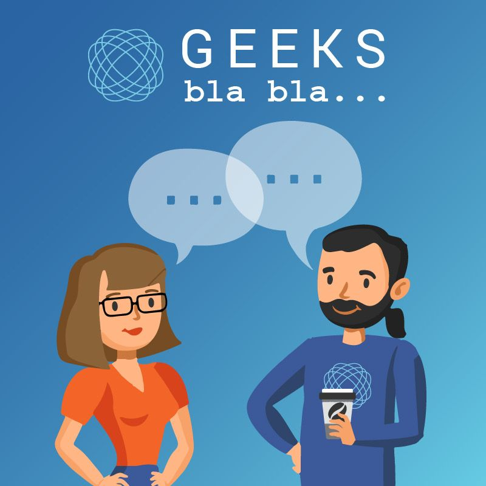

It is still surreal to me how Geeksblabla grew from this small community of enthusiasts, just talking about anything and everything, to a community as big as it is today, with everything that comes with it (Drama included\!).

But that hasn't always been the case, and probably wasn't in our bingo card for most of the (older) team members. Our goal was just to share some of our passion with the Moroccan community, in Moroccan Darija, since believe it or not, this wasn't the case in 2016 onwards.

## The Very Beginning

You may have heard about it before, or maybe not. But Geeksblabla today owes some of its success to its ancestor community Developer Circles Casablanca. A hybrid community that was built on a Facebook group with support from Facebook (now Meta) back in 2016\.

At some point, DevC Casa was the most active DevC community online in terms of engagement, which lead our efforts towards more online content creation given that it was easier to host and scale (if the internet allows it for sure).

However, I was, and still am, a strong believer in offline meetups and face-to-face gatherings. DevC hosted at least monthly events where many known faces in the community gave their first sessions, including myself. It was tough, exhausting for most of us, but enjoyable nevertheless and that is what kept us going.

At its core, DevC Casa is what helped us meet and build a core team. This team later on embarked on a journey to build Geeksblabla as it is today.
I owe a lot to Meryem Zaid, one of the earliest members who has been with me for most of the journey\!

## GeeksBlaBla is Born

Geeksblabla came out from a very unexpected, very simple idea, in a relatively weird timing\! We wanted to build upon the online success that we had in the online group and host a small, Ramadan-exclusive series of very informal tech discussions during Ramadan nights. In total, we were planning 4 episodes, 1 hour-ish each and moving on. That's really it\! No big plans, no defined structure … just having fun.

On our 1st night, what was intended to be an hour-long discussion, ended up being 3-hour-long fun and informal discussions on the DevC Facebook group. We certainly liked the vibes and the fruits of that session, and everyone was certain that we needed to keep this lively session alive.

As everything in Geeksblabla, and what defined our first strategy and guiding principle is "**experiment, reiterate, grow**"\! It is one thing to host a one-off successful initiative, and another thing to build on that success and be consistent with it.

We try as much as possible to not kill initiatives and plan thoroughly for them. It doesn't need to be perfect, it doesn't need to be unique, it just needs to be consistent. What we figured out soon after, and become our second principle "**KISS**": Keep it simple, stupid. And the reason is pretty obvious. Geeksblabla is community-based, run by volunteers who have their own lives and careers. Plans might change, and someone else needs to quickly jump in and host an episode or run an initiative by keeping the onboarding cost very low.

Combining these two principles, we started with a 1-month cadence afterwards, then bi-weekly and settled on a weekly cadence. Both Soufiane El Foukahi and Youssouf El Azizi played a fundamental role in pushing the limit and turning Geeksblabla into what it has become now.

**So What ?**

If you've made it this far, first, thank you for bearing with my writing. You might be more curious about Geeksblabla now, eager to understand what makes us tick, rather than just dwelling on our past. Let me show you what we're all about.

## Our North Star: Mission and Values

In the vast landscape of technology, communities are more than just groups—they're catalysts of change, learning, and collective growth. GeeksBlaBla might not be the largest or most famous community in Morocco, but we have something unique: a genuine passion for bringing people together, breaking down barriers, and helping each tech enthusiast find their path.

## Our Mission

> **To Empower Moroccan 🇲🇦 IT enthusiasts and beyond to thrive through continuous learning, exchange, collaboration, and innovation.**

This isn't merely a statement, although it is technically one\! We think of it as our commitment to breaking down barriers, democratizing knowledge, and creating meaningful opportunities for tech enthusiasts across Morocco. We are all Moroccan tech enthusiasts, with a deep love for our country and great passion for IT.

Our journey hasn't just been about growth—it's been a transformation. Since our beginnings, we've evolved from a small group of tech enthusiasts to a vibrant community, but our core spirit remains the same (at least we hope so). It wasn't smooth, it wasn't simple, but it was real. Through intense conversations and shared passion, we defined out three fundamental pillars that would become our north star:

- **Knowledge Exchange**: We aim to create a supportive environment that bridges the gap between novice learners and seasoned professionals. Every member has something to learn and something to teach.
- **Inclusive Diversity**: We embrace different perspectives and backgrounds, understanding that true innovation comes from varied experiences and inclusive thinking.
- **Tech for Social Impact:** We believe in harnessing the collective power of our community to drive positive change, using technology as a tool for social good.

## Our Guiding Values

Every community needs a structure, a rhythm, and a base that shows what its actions are all about. A set of values acts as a compass, guiding us honestly and giving us something to hold onto when we're not sure what to do. We have found six core values that, even though they don't cover everything, show who we are the most. We want to keep these values and live by them all the time.

- **Consistency**: “Talk is cheap, show the code” is something we bring now and then in the developer discussion. The same applies to Geeksblabla. We don't just talk; we show up. Week after week, initiative after initiative, we deliver. Knowing we'll be present, engaged, and reliable, our community can count on us.
- **Simplicity**: In a world of complex technologies, fast pace, and rapid innovation, we believe in making knowledge accessible. We break down intricate concepts, lower or even remove barriers to entry, and ensure that technology isn't a mysterious realm but an open playground for learning.
- **Transparency**: The core team of dedicated and talented colenteers, guides our efforts with transparency in mind. We believe that transparency is not a destination but an ongoing journey. We actively share our processes, challenges, and successes, fostering open communication and building genuine trust within our community. No hidden agendas or closed doors hinder our commitment to transparency.
- **Inclusiveness**: Technology knows no boundaries. We create a welcoming space that transcends experience level, background, ordomain.
- **Empathy**: Behind every line of code is a human story. We understand that each learning journey is unique. We listen, support, and create an environment where mistakes are learning opportunities and every achievement is celebrated.
- **Accountability**: We take ownership—of our learning, our contributions, and the impact we create. When we commit, we follow through, individually and collectively.

## Closing Thoughts

I hope this article helps you understand what Geeksblabla is all about. We're more than just a tech community \- we're a family of learners, dreamers, and innovators.

A heartfelt thank you to everyone who has been part of our journey. To our past core team members who laid the foundation of Geeksblabla, your vision and dedication have been the cornerstone of our growth. Our incredible podcast guests who continue to generously share their knowledge and inspiring stories \- you've been the voice that has educated and motivated our community. To all BlaBlaConf speakers, thank you for bringing your expertise and insight to our special event and connecting our community across digital spaces.

We extend our gratitude to every community member, from the long-time contributors to the newest participants. Each of you has played a crucial role in creating this vibrant, supportive ecosystem of tech enthusiasts and lifelong learners.

Our story is still being written, and we can't wait to see what chapters come next. If you're passionate about technology, curious about learning, or just want to be part of something amazing, Geeksblabla is waiting for you.
The best is yet to come.
