Have you ever tried doing something you’ve never done before and weren’t sure if you could pull it off?

Hey there\! I’m Hafsa, a homeschooled high schooler from Casablanca, Morocco, and a member of [Hack Club](https://hackclub.com/), the largest global community of technical teenagers. In mid-November 2024, I took on the challenge of organizing [Counterspell Casablanca](https://counterspell.hackclub.com/casablanca)—my city’s first-ever teenage-led game-jam hackathon and part of a global event happening in over 60 cities.

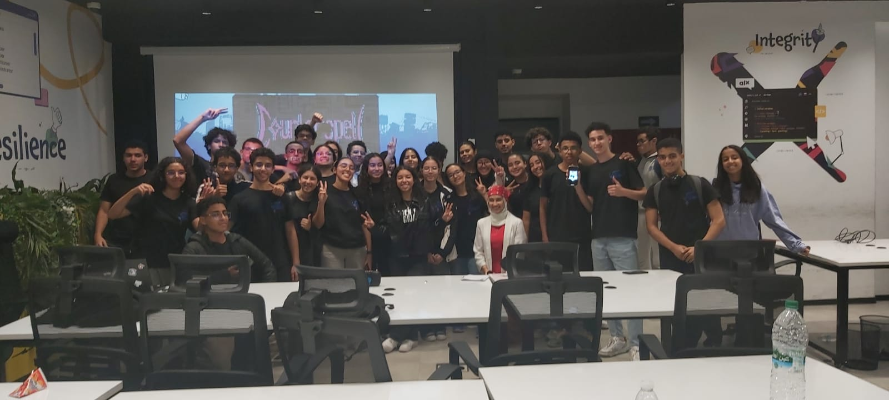

This article is about how I went from wondering if I could organize a hackathon to making it a reality, and everything I learned along the way.

**Getting the inspiration**:

Let’s start at the very beginning: how I discovered this event and convinced myself to organize it. 

In the summer of 2024, I joined one of Hack Club’s programs called [Arcade](https://hackclub.com/arcade/). This program encouraged teens to build projects, and based on the time they spent working on them, they earned tickets. These tickets could then be exchanged for prizes like Raspberry Pis, keyboards, MacBooks, GitHub swag, and so much more.

I managed to get a few prizes, and each time, they came with a card explaining what Hack Club is. On my last order of the program, at the end of the summer, something was different. The card didn’t just talk about Hack Club; it introduced some of the other programs they offer. That’s when one program, in particular, caught my eye.

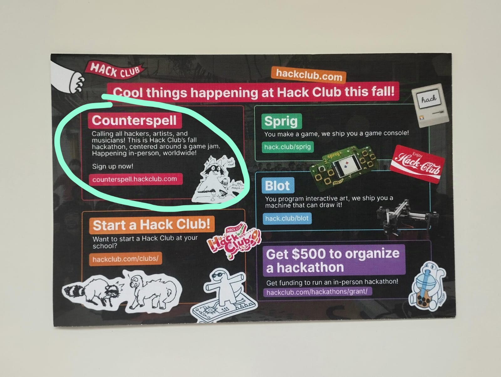

It was Counterspell. At first, I thought it would be really cool to finally join a hackathon since I had never been to one before. I headed to the website to check it out and started reading about it. It seemed so fun, and I was already getting excited, thinking about the kind of game I could make and the new things I could learn.

Then I got to the signup form. There were two options: one to register as a participant and another to apply as an organizer. I went straight for the participant form, filled out all my details, and reached the part where I had to select my event. That’s when I realized that there wasn’t a single Counterspell event in the whole Maghreb region. I was pretty upset at first, but after a little while, I just moved on.

Fast-forward a few days, and the organizer form crossed my mind again, so I decided to take another look. Before applying, there was a message from Hack Club’s events lead (below), and it really stuck with me.

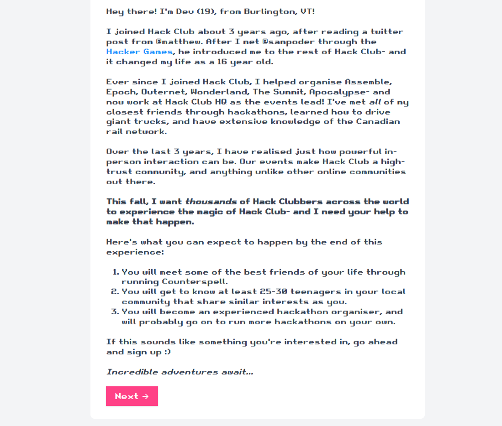

The idea of bringing Hack Club’s magic to my city sounded awesome. I’d seen how they ran these super cool hackathons like [Apocalypse](https://www.youtube.com/watch?v=QvCoISXfcE8&t) and [Wonderland](https://www.youtube.com/watch?v=X1EVT0vUxAg), and I thought, why not do something like that here? It felt like a chance to introduce local teens to Hack Club and give them the chance to be part of something bigger.  
But then, I started overthinking. I mean, I had never even attended a hackathon before, so how could I possibly organize one? What if no one showed up? What if people just weren’t interested? Those questions made me hesitate, so I decided to wait for the kickoff call for organizers, which was open to everyone, before making my decision.

When the day of the kickoff call came around, I joined, hoping it would help me figure out if this was something I could actually pull off. As I listened, I heard stories from other teens who were just as excited (and just as nervous) about organizing their own events. It was honestly so inspiring. The Hack Club team shared tips and advice, but what stuck with me most was when they said that anyone, no matter their experience, could make it happen with the right mindset and support. That’s when it clicked for me: everyone has to start somewhere, so why not me?

After the call, I felt a mix of excitement and nerves, but Hack Club’s promise to guide us every step of the way made me believe I could actually do this. It felt like a chance I couldn’t let slip by, so I took a deep breath, opened the organizer form, and decided to go for it.

A few days later, I got an email saying I was officially accepted as an organizer. That’s when it hit me: I had just committed to organizing a teenage hackathon in Casablanca, a city where events like these aren’t very common. This thought was equally exciting and terrifying. But I knew that I’d never know what I was capable of unless I gave it a shot. So, I made a promise to myself—I’d take it one step at a time, trust the process, and figure it out as I went. And whenever a problem came up, I’d somehow find a solution.

**Starting out**:

The first thing I did was start looking for venues because, after all, we needed a space to host the hackathon. To keep everything organized, I created a Google Sheet where I listed all the potential venues, along with the name of the person in charge and their email address. This allowed me to track my outreach efforts and stay on top of who I had contacted.

I also started pitching the idea to potential teenage co-organizers who could help. I knew it would be a lot of work, and I wanted a team who’d share my excitement and passion for this event (and also make this a less daunting task). By the end, we were a team of four, and together, we all started sending out emails to potential venues.

At the same time, I realized something important: I had never attended an in-person hackathon before. How could I organize something I’d never experienced myself? I needed to see what it looked like—not just from the perspective of a participant but also from the perspective of an organizer.

I searched for in-person hackathons in Casablanca, but there weren’t any, only virtual ones. The closest option was the NASA Space Apps Hackathon in Tangier. Luckily, I knew one of the organizers, [Laila Berchane](https://ma.linkedin.com/in/lailaberchane) (who also lived in Casablanca), so I decided to travel there with her. Not only would I get to see the event from behind the scenes, but I’d also have the chance to experience it as a participant and pitch my hackathon idea to her. She ended up liking the idea and offered to support us by sharing her insights and even sponsoring us\!

The experience was worth every moment. (Here’s a group photo below\!) I walked away with a much clearer picture of what an in-person hackathon should feel like. I also learned some important details. For instance, not everyone who signs up will actually attend; out of 60 people registered, only about 21 showed up. Another tip was to have participants form teams at the event rather than beforehand—it makes things smoother for those who come solo and prevents anyone from feeling left out.

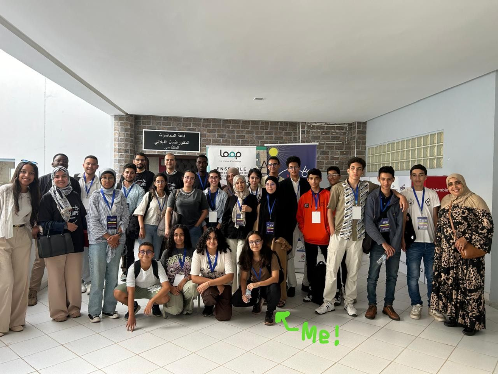

Anyways, back to the venue search. After we compiled a list of potential venues, the next step was to figure out who to contact. We were mainly looking for people at the C-suite level, as they’re the ones who can make the decision, but also project managers or anyone who might have the authority to help us out. Honestly, this part was tough. Finding the right person to reach out to was way harder than I expected. Writing the email and figuring out the venue was easy compared to finding the right contact.

If you’re in the same situation, my advice is to check the venue’s website first to see if they have contact details. If not, tools like RocketReach.co or Apollo.io are helpful, but for me, LinkedIn worked best. I found that connecting with people there and sending a direct message was the most effective approach.

So, after sending out tons of emails to different venues and people, we were met with complete silence, which was incredibly discouraging for me and my team. It felt like we were hitting a dead end, so we decided to ask around and see if anyone knew a place that might be willing to host the hackathon. We got a few contacts and reached out, and eventually, we got an okay from a school (Subrini Val Fleuri). Initially, we had our hopes set on finding a sleek, modern venue, like something in Technopark Casablanca, but we were still incredibly grateful to have a space secured.

We visited the school to make sure it would be suitable for the event, and after that, we signed a Memorandum of Understanding (MoU) to officially secure the venue. At that point, we thought we had everything in place for our originally planned 12-hour hackathon.

Then, for some reason, a few days before signing the MoU with the school, I decided to follow up on an email I had sent to one of the venues we really wanted: ALX Morocco in Technopark Casablanca. And guess what? They responded positively the very next day—just after we had already signed the MoU with the school\! Our team and I were overjoyed, but there was a problem: we had already signed the contract with the school. We couldn’t just back out of that and move everything to ALX Morocco.

But I really wanted Technopark. So, after a very long debate with my teammates, we decided to make the hackathon a two-day event: Day 1 at the school and Day 2 at ALX Morocco. Some of us were still conflicted about this decision, especially with concerns that everyone would show up on Day 1, but very few would attend on Day 2\. We went with it anyway, and looking back, it was definitely the right call\!

Looking back, this whole process taught me a lot. Here are some key lessons I took away from this stage:

* **Follow up is crucial**: Sometimes, a simple follow-up email can make all the difference. I almost missed out on a great opportunity with ALX Morocco because I didn’t follow up earlier.  
* **Be flexible**: Plans will change, and that’s okay. Be open to adapting as you go. We had to shift from a one-day to a two-day hackathon, and it ended up being a great decision.  
* **Ask for help**: When we were struggling with our venue search, reaching out to people we knew for recommendations made a difference.  
* **Don't settle, but also don't wait too long**: We were aiming for a cool venue like Technopark, but we had to accept what we could get. However, that didn’t stop us from exploring other options and making the best of what we had.  
* **Clear communication with the team**: It was important to get everyone on the same page when things were shifting, especially when deciding to split the event across two locations.

So, with the venues finally secured, it was time for the next thing...

**💸 Sponsorships 💸**:

Finding sponsorships was one of the hardest parts, if not the hardest, of organizing Counterspell. Just finding the right person to contact was already a struggle, but getting a response was even harder. Most of the companies we reached out to just ghosted us. Some replied with a quick “We’ll get back to you soon,” and then disappeared, while others even responded positively at first but stopped replying when we followed up or gave them more details.

I honestly couldn’t tell if the problem was that our emails weren’t convincing, if they didn’t like the idea, or if it was the fact that we were just a group of teens asking for money while having no prior experience organizing an event like this. Whatever the reason, we knew we needed funding to make this hackathon happen, so we kept sending out more cold emails.

One of the organizations we reached out to was GOMYCODE. After sending multiple messages (some to emails we weren't even sure were correct) and reaching out on LinkedIn with no response, we decided to try something different. Instead of waiting for a reply that might never come, we showed up at their office.

At first, we thought we’d just talk with someone at the reception. Instead, we hit the jackpot—we ended up meeting their CEO, the hackerspace manager, and their social media manager all at once. When we pitched our hackathon to them, they showed interest in supporting us but also hinted that they wouldn’t be able to help financially, which made sense—giving money to someone you just met isn’t exactly ideal. However, they offered to host a workshop and provide a prize for the tombola: a free coding boot camp on a subject of the winner’s choice. While it wasn’t the financial support we were hoping for, it was still a meaningful contribution that added value to our event. Here are some pictures of them at the hackathon\!

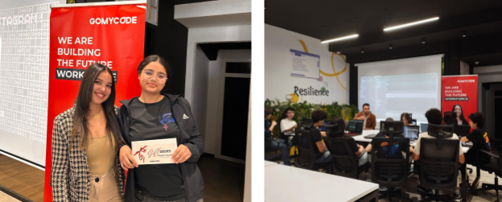

After that encounter, we started rethinking our approach. Cold emails and LinkedIn messages weren’t getting us very far, and while showing up in person worked once, it wasn’t always an option. That’s when we decided to reach out to people we already knew. One of our co-organizers had a contact at Coca-Cola, and thanks to that, we managed to secure an in-kind sponsorship (water \+ sodas), which was a big relief. Another teammate had a connection at a local company called Pesage Promotion, and they also agreed to financially sponsor us.

We were also part of a robotics center called Robots & More Academy, where we currently participate in a robotics competition called FTC (First Tech Challenge). One of the organizers of the NASA Space Apps Hackathon in Tangier (who’s also the CEO of this center), where I had first pitched the hackathon idea and who had been supportive of it, offered to sponsor us. This support gave us the encouragement we needed and kept us going.

Then, Hack Club sponsored 50% of our budget, which helped us finally complete our financial plan and move forward with the event.

Looking back, securing sponsorships was by far one of the hardest parts of this whole journey. Reaching out to people you don’t know for financial support is ridiculously difficult, especially when you’ve never organized an event before and especially as a teen. While cold emailing worked for some Counterspell events, it didn’t work as well for us, primarily because we were working with limited time. If we had reached out to more organizations or had more time to follow up, I think we could have secured additional sponsorships.

Hack Club shared [this video](https://www.youtube.com/watch?v=tOmXzA4reTY) with us, which offers valuable tips on how to convince sponsors for your event. I’d recommend giving it a watch—the advice on crafting a compelling pitch and staying persistent is incredibly useful and could make a big difference if you have the time to implement it.

For anyone in a similar position, I’d recommend reaching out to companies that your friends or their parents know, or even companies you have personal connections with—especially if it’s your first time organizing an event. The second time around is probably going to be easier, as you can show that you've already successfully organized an event. If you're a teen who wants to manage your project's finances in a credible way, I'd highly recommend Hack Club Bank ([HCB](https://hackclub.com/fiscal-sponsorship/)). We used it for Counterspell, and it made everything so much easier. Plus, it offers transparent finances, and you can see all of our transactions here: [hcb.hackclub.com/counterspell-casablanca/](http://hcb.hackclub.com/counterspell-casablanca/)

With a venue secured and the budget finally in place, the next step was finding participants to bring this event to life\!

**Outreach 📢**:

The first thing we tried for sign-ups was social media. We knew from the start that social media alone wouldn’t bring in everyone we needed, but having some kind of online presence seemed essential. So, we started filling up our Instagram account with posts introducing Hack Club, then followed that up with the official announcement of Counterspell Casablanca. But since we knew this wouldn’t be enough, we decided to contact organizations that could help spread the word.

The first organization we reached out to was [eSTEM Morocco](http://estem-morocco.org/), which focuses on empowering Moroccan girls to get into STEM. They loved the idea of the hackathon and not only promoted it on their social media but also mentored us through the process. Their support really made a difference, bringing in sign-ups and helping us figure things out along the way.

I was also in touch with Youssouf El Azizi from Geeksblabla on LinkedIn. As I shared updates about our progress, he kindly offered to promote the hackathon on their social platforms, which had a huge impact in reaching more people in the Moroccan tech community.

Partnering with GOMYCODE Morocco also gave us a boost. They promoted the event on their platforms, which brought even more visibility.

On top of that, we reached out to schools by email, pitching the hackathon to teachers (and sometimes the school principal if we couldn’t find a teacher’s contact). This turned out to be one of the most effective methods for getting sign-ups. Honestly, this is where we should have started\! A lot of tech teachers are eager to find opportunities for their students, and when they see that it’s another student organizing the event, they’re usually pretty supportive. Here’s an example of the email I sent to one school director:

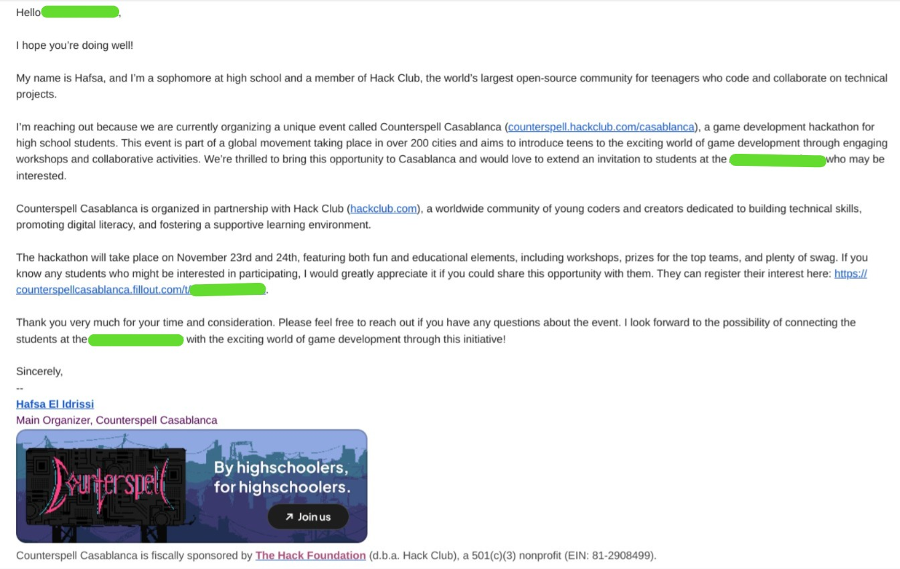

We also tried inviting people we already knew, but that didn’t work as well—we only got around five participants that way. We reached out to a few coding clubs, but only one responded.

Robots & More Academy was another big help. Not only did they sponsor us, but they also promoted the event on their social media, mentored us, and shared tips from their own experiences hosting events. Their advice was incredibly helpful throughout the process.

Since we learned through the NASA Space Apps Hackathon that participant drop-offs are common (50% of those registered didn’t show up) we planned to overbook slightly. By the end, we had 76 participants registered (we were aiming for 30 participants), making sure that we’d hit our target even with a few no-shows.

So with the venue, funding, and participants sorted, we turned our attention to planning the event itself.

**Planning 📝**:

With the hackathon just weeks away, there was still plenty to figure out. One of the first priorities was building a team of volunteers. While we’d already reached out to a few people earlier, this was when we really put our focus on it. We contacted people we thought would be a great fit, explained the hackathon, shared our vision, and outlined what was expected of them. By the end, we had 10 amazing volunteers ready to help\!

Next on the list was confirming our venues. We didn’t want any last-minute surprises, so we double-checked with both locations to make sure everything was still on track. Thankfully, they were ready to host us, with everything set up as promised.

We also began finalizing the workshops and mentors for the event. We already had a mentor from GOMYCODE on board, but he could only join us on Sunday. I reached out to a data scientist I had met before, and he was happy to conduct a workshop as well. Geeksblabla contributed with a very insightful talk, which added a lot of value to the event. Some of our volunteers even stepped up to lead their own workshops, so we were all set on that front\! Finalizing the schedule was another big step. It took a lot of back and forth to get everything to fit, but seeing it come together was a huge relief.

Food was another big thing on our list. After all, we didn’t want our participants starving halfway through. We started looking into local caterers and small businesses, but most were either pricey or unavailable for an event like ours. Even when we found decent options, getting them to respond was a whole other challenge. Luckily, Robots & More came through with recommendations from their past events and connected us with a caterer.

We also started making something called a “run of show,” which is essentially a detailed outline of what each person should be doing during the event. Here’s a small portion of it as an example:

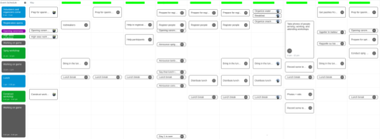

This turned out to be incredibly useful on the day of the event. Under all the stress, it’s easy to forget something important, but having this as a guide kept things running smoothly. At first, we tried using a Google Sheet for this, but it was painful to make and manage. So we decided to use [always.sh](http://always.sh), it’s a new tool that works surprisingly well for creating a run of show. Highly recommended\!

Communication with participants was also a priority. We decided to create a WhatsApp group for the event since it’s the go-to app for most people here. It made it easy to send updates, reminders, and answer any last-minute questions leading up to the hackathon.

And so, with all the planning behind us and everything set, the countdown was over—it was the day before the event.

**🗓️ Day Before the Event 🗓️**:

And so, with all the planning behind us and everything set, the countdown was over—it was the day before the event.

There was still plenty to wrap up that day. First, we sent out a final announcement to the WhatsApp group and by email, making sure participants had all the details: what to bring, the schedule, and a few last-minute reminders.

Then came the checks. We confirmed with the caterer, and thankfully, everything was on track. But the questions started flooding in during the afternoon—so many questions\! It felt like everyone had something they needed to know. It took three of us working together to keep up with all the replies.

On top of that, we prepared the money we’d need for the event, double-checked with both the school and ALX to make sure everything was good to go on their end, and got the t-shirts ready for the volunteers and participants (here’s a picture of them below if you haven’t seen them).

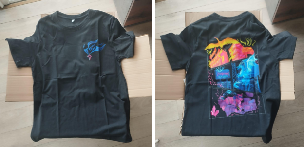

By the end of the day, we’d done everything we could to get ready. All that was left was to wait and hope for the best.

I’ll be honest—this was when the nerves really hit. That day was a mix of excitement and anxiety. On one hand, I was excited that everything we’d been working on was finally about to happen. On the other hand, I couldn’t stop worrying. What if no one showed up? What if too many people showed up? What if the volunteers handling registration came late? These questions just kept running through my mind, bringing back all the doubts I had when I first started planning the hackathon.

But whenever those feelings got too overwhelming, I reminded myself of something a previous hackathon organizer had shared with us:

*"During Assemble, we had a grumpy security guard threaten to call 911 on an attendee for riding on a chair. During Epoch, the venue owner video-called me at 11:30 PM, demanding I shut down our midnight disco on New Year’s Eve. During the Boreal Express, a whole part of western Canada burned down, and we had to turn the train around. When I share these stories with attendees, none of them ever remember the chaos. All they remember is the amazing time they had with other Hack Clubbers, the projects they built, and the memories they made. Organizing hackathons is always a walk on a tightrope, and things will always go wrong. Instead of trying to perfect every logistic, focus on connecting with people, getting to know them, and supporting them throughout the event."*

That really helped calm me down, even if just a little. It reminded me that even if something went wrong, we’d find a way to fix it.

**The big day:**

And so, it was the morning of Day 1\. I arrived at the school at around 7:30 a.m., feeling a bit anxious while looking forward to the day ahead. It was reassuring to see the entire team already there, on time, and following the run of show. Those handling the opening ceremony got ready, while the volunteers in charge of registration set up their stations. We even brought breakfast for everyone, which gave us a chance to sit together, enjoy some food, and pump each other up before things officially kicked off. We played some music to set the mood and then waited for participants to arrive.

To our surprise, the first participant arrived at 8:25 a.m., even though we’d said registration wouldn’t start until 9\. It caught us a bit off guard, but we just rolled with it. By 9am, though, only a handful of people had shown up—just three or four. I couldn’t help but worry a bit. What if this was it? But then, slowly but surely, more and more participants started arriving. By the end of registration, we had 42 participants, which was more than the 30 we’d planned for\! It was such a pleasant surprise, even though it meant we ran out of shirts 😅.

After registration, it was time to get everyone into the biggest classroom for the opening ceremony. It took longer than we’d expected to gather everyone—turns out organizing 42 teenagers isn’t easy—but eventually, we got started. We thanked them for coming, gave a quick overview of the event, explained the schedule and rules, revealed the theme, and talked about how judging would work (it was peer-voted, so no complicated rubrics). Finally, we wrapped up by talking about the prizes, which really got everyone excited. Overall, things went pretty well, though we did have a few moments where the Wi-Fi acted up.

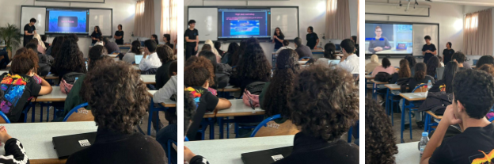

Next came team formation. We’d planned for this to take about 10 minutes, but it ended up being even quicker—just 6 minutes—since most teams had already been formed in the WhatsApp group the day before. And with that, the hackathon officially kicked off.

Of course, it didn’t take long for the first issue to pop up. The classroom had very few wall outlets, and almost everyone needed to charge their laptops. On top of that, the Wi-Fi couldn’t handle 42 devices at once, which caused it to slow down and would’ve been a nightmare for the participants. We decided to split the teams into different classrooms, and after that, everything worked fine.

Then came the first workshop, and, of course, another problem. The TV in the classroom didn’t support HDMI or USB inputs, only DVI, and the person conducting the workshop didn’t have a DVI adapter. Thankfully, one of the co-organizers happened to have the right port, so the issue was resolved quickly. 

After that, the rest of the day went surprisingly well. The food arrived on time (a rare miracle, honestly), distribution was smooth, and participants seemed happy. Some teams even had a working prototype of their games by the end of the day.

At 5:15 p.m., we wrapped up Day 1 with a brief closing ceremony. We reminded participants of the location for Day 2, motivated them to return by mentioning the tombola from Gomycode, and waited until everyone had left before calling it a day ourselves.

Then came Day 2. Walking into Technopark that morning felt pretty cool—for some of us, it was our first time there, and stepping into ALX added to the excitement. It was a fresh start, and we wanted everything to go smoothly. We all went over the run of show again, double-checking every detail to make sure we didn’t miss anything.

Some volunteers headed to a nearby store to grab breakfast, others waited by the Technopark entrance to register participants, and a few stayed inside ALX to greet them as they arrived. We expected all 42 participants to show up, but after a while, it became clear that three wouldn’t be making it. We decided to start without them.

We kicked off by presenting the day’s schedule and reminding everyone of the ground rules. And just like that, Day 2 was underway!

Later in the morning, we greeted the Gomycode representative and mentor, who had a workshop scheduled at 11 a.m. On my way to show them the way to ALX Morocco, I ran into Youssouf El Azizi from Geeksblabla. He arrived super early, even though his talk wasn’t until 4 p.m.—which was a really nice gesture.

The workshop with the Gomycode mentor went pretty well. The participants seemed to enjoy it, and everything felt like it was running smoothly. The only problem that we encountered up to that point was that the caterer arrived about 30 minutes later than expected. It wasn’t a huge deal, though—it just meant lunch started a bit later. Once the participants had finished eating, our team grabbed some food too.

Just as we were settling down for lunch, the security team informed us that some participants were wandering around the building, which wasn’t allowed. To address this, we quickly made an announcement explaining the rule: participants couldn’t explore the building on their own, and if they needed to leave ALX, they had to inform a volunteer. We also set up a rotation system, making sure there was always someone stationed near the exit.

By 2:15 p.m., it was time for the next workshop, led by data scientist Othmane Rhaouti. This session also went smoothly, and it was clear that the participants found it engaging and insightful.

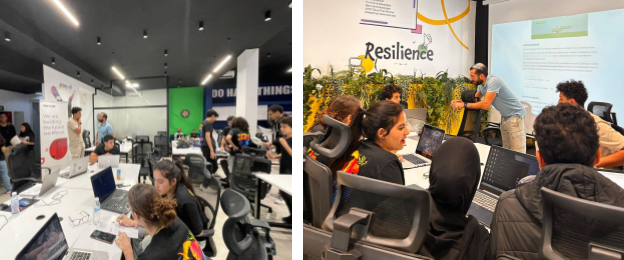

Then, at 4 p.m., it was time for Youssouf El Azizi’s talk. He shared some really interesting insights and experiences, and the participants seemed to enjoy it. They asked a few questions, and it felt like a nice way to keep the energy going as the day started to wind down.

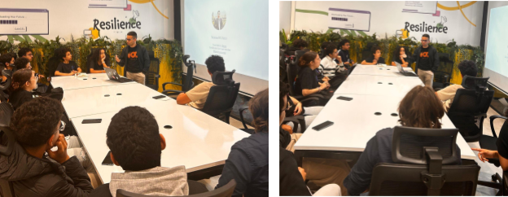

After this, we explained how to submit their projects, and soon they got to work. At 5 p.m., the plan was for participants to have supper while we started the game demos. But that didn’t exactly go as planned—everyone rushed for the snacks first, which delayed the demos by like an hour. It threw us off schedule a bit, but once things got back on track, the demos went pretty well.

The voting process followed, and then came the moment everyone was waiting for—announcing the winners and their prizes. We didn’t hand out the prizes on the spot; instead, they would be shipped directly to the winners’ addresses. After that, we gathered everyone for a group photo, shared our farewells, and just like that, Counterspell Casablanca came to an end.

**Final thoughts:**

I was honestly relieved to see how well the hackathon turned out. All the things I had been worrying about for weeks—the chaos, the worst-case scenarios—never really happened. Watching everyone having fun, collaborating, and working with people they’d just met for the first time made all the stress and late nights feel worth it.

Of course, this wouldn’t have been possible without the amazing team of co-organizers and volunteers who stood by me every step of the way. From brainstorming sessions to late-night calls, from managing logistics to solving unexpected challenges on the spot, your efforts made all the difference. To our mentors, speakers, and sponsors—thank you for your time, energy, and trust in this vision. And to everyone who showed up, you made this hackathon more special than I could have ever imagined.

So, what would I say to someone thinking about organizing an event like this for the first time? Just go for it. Yes, it’ll be hard at times. There will be moments when you’ll question everything—whether people will show up, whether things will fall apart, whether you’ve made the right choices. But here’s the thing: it’s okay for things to not be perfect.

What matters is the connections people make, the learning that happens, and the memories you’ll help create. There’s something incredibly rewarding about seeing an idea that started on paper come to life. It’s not about being flawless; it’s about being present, adapting, and making the experience as meaningful as you can.

Trust me, the joy of seeing people come together, create something new, and leave feeling inspired? That makes every single challenge along the way absolutely worth it.

**What is next 🤔:**

After organizing Counterspell Casablanca, I’ve realized just how much potential so many young people in Morocco have. Seeing teens come together, create amazing projects, and try new things made me think: what if more people had access to opportunities like this? I truly believe that if we reach more youth and give them the tools to learn tech skills, we could help spark something incredible in Morocco’s journey toward digital innovation.

That’s why we’re now working on starting [Hack Clubs](https://hackclub.com/clubs/)\! These are student-led clubs where teens can learn to code, work on projects, and support each other while having fun. The way it works is pretty simple: every week, the club leader introduces a new topic or idea, and the members dive in. They work on projects related to that topic, learn by doing, and share what they’ve made with the world (check out what that looks like here: [hackclub.com/ship](https://hackclub.com/ship/)).

Most [Hack Clubs](https://hackclub.com/clubs/) are based in schools (which is where we’re focusing for now), but they can also be set up in libraries, fab labs, or any place where teens can meet and learn together. We’re especially excited about bringing Hack Clubs to rural areas where coding isn’t as well-known—because everyone deserves the chance to discover what they can do with technology.

If you’re a teen who wants to start a Hack Club in your school, we’d love to hear from you\! By starting one, you’ll join a global community of Hack Clubs and get access to some amazing resources, like:

* Ready-to-go workshops ([jams](https://jams.hackclub.com/)) to help your club get started  
* Free tools like Figma Pro, GitHub Education, and Zoom Pro  
* Fun programs like [Arcade](https://hackclub.com/arcade/), [High Seas](https://highseas.hackclub.com/), and [Boba Drops](https://boba.hackclub.com/) to keep things exciting  
* Support from Hack Club through the [Slack community](https://hackclub.com/slack) every step of the way

Want to see what a Hack Club meeting looks like? Check out this video: [youtube.com/watch?v=xXIxwV7bQTw](http://youtube.com/watch?v=xXIxwV7bQTw)

If you’d like to start a Hack Club or support us in any way, feel free to reach out\! You can email us at [hackclubcasablanca@gmail.com](mailto:hackclubcasablanca@gmail.com) or message us on Instagram: [Hack Club Casablanca](https://www.instagram.com/hackclubcasablanca/).

We’re also planning our next teenage hackathon, [Scrapyard Casablanca](https://scrapyard.hackclub.com/), on the weekend of March 15th\! It’s going to be a lot like Counterspell Casablanca, but with a fresh twist—the theme is all about being “scrappy.” 

The idea is to get creative and build something fun, whether it’s a game, an app, or even a quirky hardware project. This theme is all about experimenting and letting your imagination run wild, without worrying about making it perfect. By the end of the event, the goal is just to have something cool and complete that you’re proud of. If you want to stay updated about Scrapyard or any of our other events, you can follow [Hack Club Casablanca](https://www.instagram.com/hackclubcasablanca/) or connect with me on [LinkedIn](https://ma.linkedin.com/in/hafsa-elidrissi).  

This is just the beginning. We’re excited about all the possibilities ahead and the chance to keep building a community where young people can learn, create, and support each other. There’s so much more to come, and I hope you’ll be a part of it.